# Buat Module
go mod init belajar-golang-dasar

# Compile
go build

# Run
go run namefile.go

# Tipe Data Integer (1)

# Tipe Data Integer (2)

# Tipe Data Floating Point (number.go)

# Alias

# Boolean (boolean.go)

# Function untuk String

# Variable

# Tipe Data Variable

# Function Array

# Tipe Data Slice

\
**Membuat Slice dari Array**
\
**Function Slice**

# Function Map
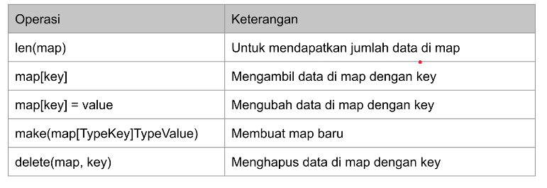
# Switch Expression
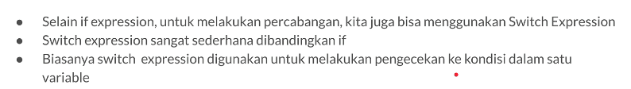
# Break and Continue
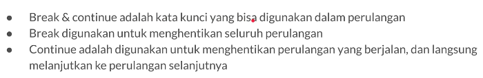
# Function
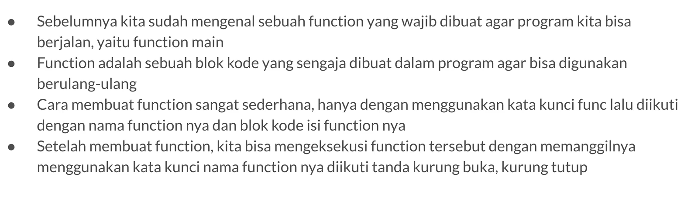\
**Function Parameter**
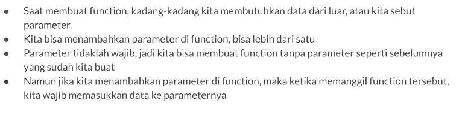\
**Function Return Value**
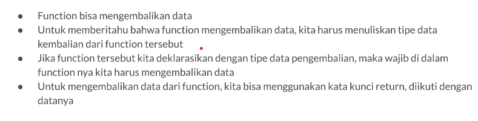\
**Returning Multiple Values**
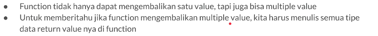\
**Menghiraukan Return Value**
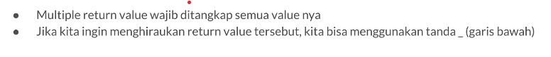\
**Named Return Values**
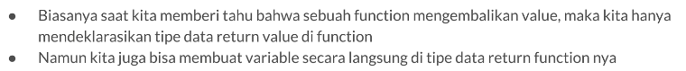\
**Variadic Function**
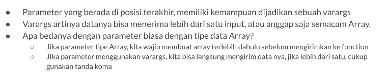\
**Slice Parameter**
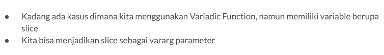\
**Function Value**
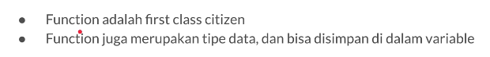\
**Func Type Declarations**
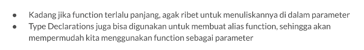\
**Anonymous Function**
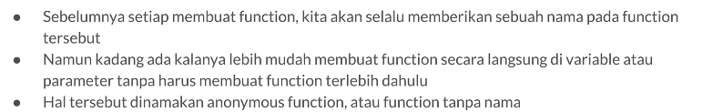\
**Recursive Function**
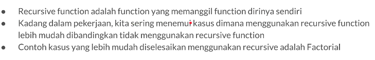\
**Closure**
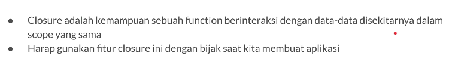\
**Defer**
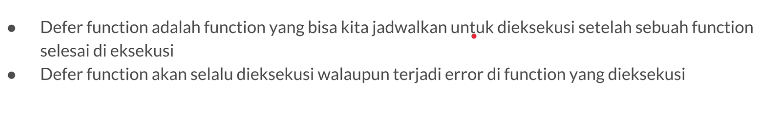\
**Panic**
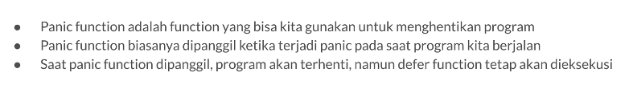\
**Recover**
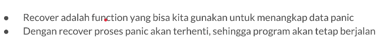
# Struct
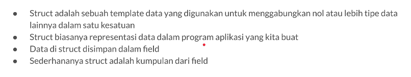\
**Data Struct**
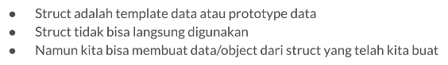\
**struct method**
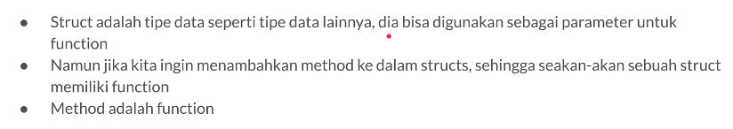\