# Buat Module
go mod init belajar-golang-dasar

# Compile
go build

# Run
go run namefile.go

# Tipe Data Integer (1)
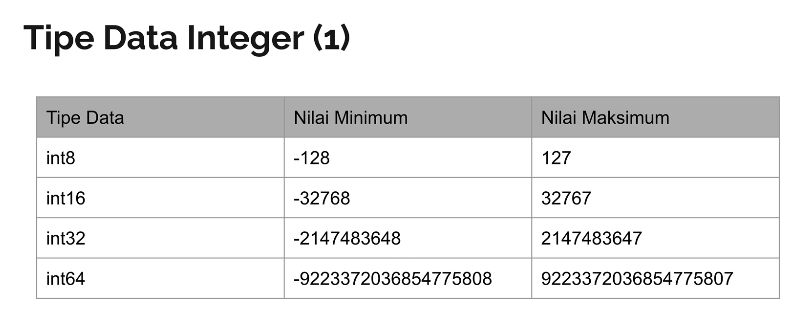

# Tipe Data Integer (2)
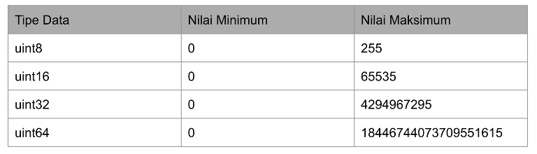

# Tipe Data Floating Point (number.go)
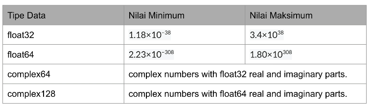

# Alias
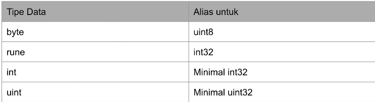

# Boolean (boolean.go)
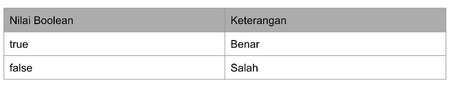

# Function untuk String
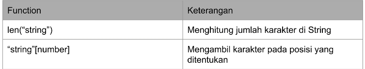

# Variable
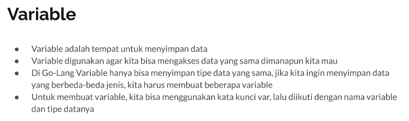

# Tipe Data Variable
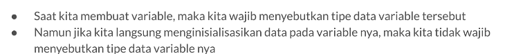

# Function Array
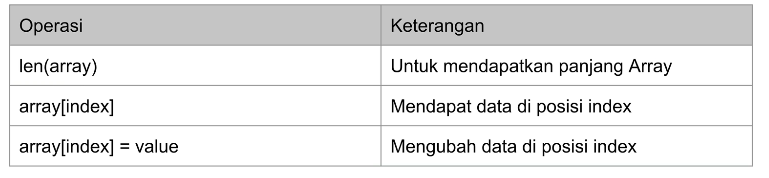

# Tipe Data Slice
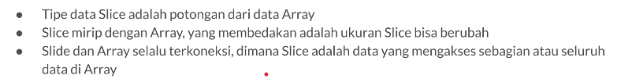
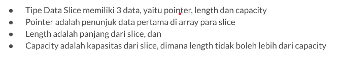
**Membuat Slice dari Array**
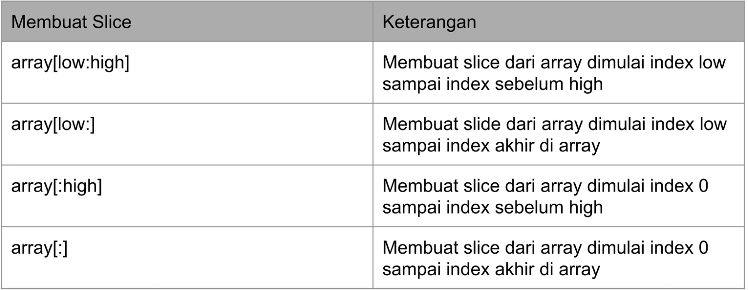
**Function Slice**
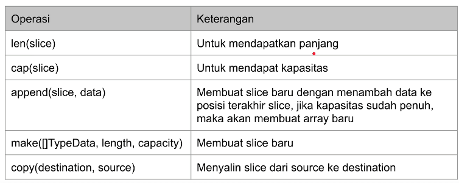